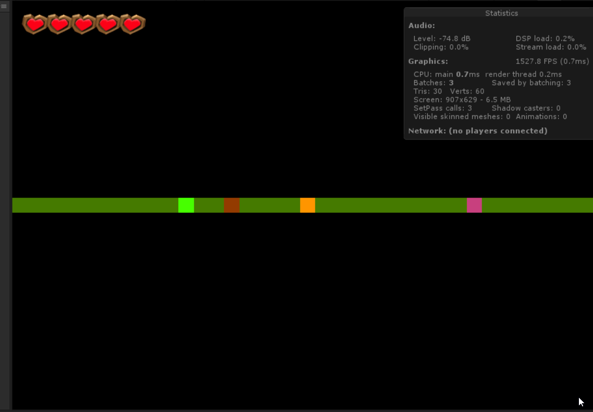

# Gamekit 1D

After the [Gamekit2D](https://unity3d.com/learn/tutorials/s/2d-game-kit)
and the [Gamekit3D](https://forum.unity.com/threads/3d-game-kit-beta-feedback.525246/) :

Introducing the Gamekit1D, a game kit to do a 1D game in Unity. Play as Ellen
fighting Chompers on an alien planet, breaking boxes and avoiding acid pools.

_Ok this is obviously a joke made in one day, this is not a real kit, but I may
come back to it at some point to add door & pressure pad._

_A gameplay session where Ellen (orange) attack a chomper (pink) on the right,
before breaking a Box (brown) and falling in an acid pool (green). She then jump
over it to avoid it._

## Control

 - Left/Right arrow (or A/D or any Horizontal input you define in the InputManager :
   Go left or Right
  - Left click or Ctrl (Fire1 input) : hit with your staff in front of you (_front
    is which direction your pressed last_)
  - Space : jump over the next cell you're facing.
